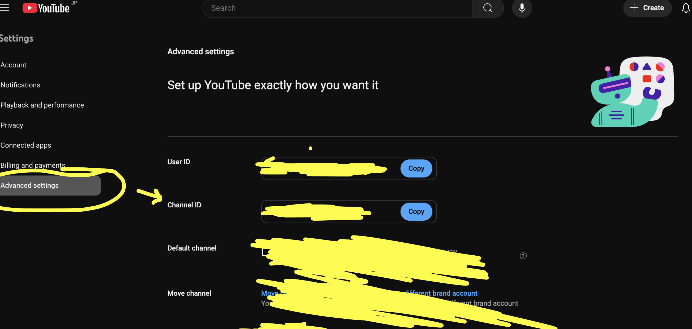

# P2.5 LED Matrix with ESP32S3

This repository contains examples to get started with HUB 75 P2.5 RGB Matrix and ESP32 S3

It contains examples for P2.5 LED Matrix, along with a python code to convert a GIF to raw frames. The tutorial for using this repo can be viewed in the video:

### LED_Matrix_Wires

### ESP32S3 Pinout

### ESP_to_LED

### Blue Green Inverted Colors

## Follow the Images below to get Youtube Data API

- Open https://console.cloud.google.com/
  Click on project name and create a new project
  
  Give it a name and click on create
  
  Make sure the right project is selected, and in the Search bar, search for Youtube Data API v3
  
  
  Enable the API
  
  Create credentials and copy the API key
  
  
  

For Channel ID, go to youtube settings -> advanced settings -> Channel ID

